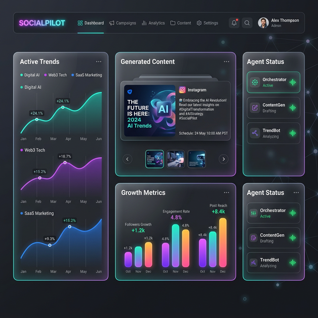

# � SocialPilot: The Autonomous Media Engine
> **Agentic social media management at scale. Powered by LangGraph & CrewAI.**

SocialPilot is an enterprise-grade autonomous system designed to handle the entire lifecycle of social media marketing—from trend discovery to content creation, safety validation, and automated scheduling. 



## 🌌 Core Value Prop
Traditional social media management is slow, manual, and reactive. **SocialPilot** flips the script:
- **Proactive Intelligence**: Detects trends *before* they peak.
- **Brand Guardrails**: Autonomous safety checks prevent PR crises.
- **Human-in-the-Loop**: Seamless approval workflow for sensitive content.
- **Multi-Agent Orchestration**: Specialized agents for every task (X, LinkedIn, Meta).

---

## 🏗️ Neural Architecture
SocialPilot uses a **StateGraph** orchestration layer to coordinate a "Crew" of specialist agents:

| Agent | Purpose | Intelligence Level |
| :--- | :--- | :--- |
| **Orchestrator** | Master Supervisor & Router | Claude 3.5 Sonnet |
| **TrendAnalyzer** | Cultural Signal Detection | GPT-4o (Pattern Recognition) |
| **ContentGenerator** | Creative Copy & Visual Briefs | Claude 3.5 Sonnet |
| **SafetyOfficer** | Ethics & Brand Guardrails | GPT-4 (Critical Analysis) |
| **Accountant** | ROI & Growth Analytics | GPT-4o |

---

## 🚀 Deployment Guide

### 1. Environment Sync
```bash
cp .env.example .env
# Toggle MOCK_MODE=true for local dry-runs without API costs
```

### 2. Ignition
Start the dual-layer system (API + Dashboard):

**Backend (FastAPI)**:
```bash
uvicorn app.main:app --reload
```

**Control Center (Dashboard)**:
```bash
python run_dashboard.py
```

---

## 📡 Protocol Interface (API)

### `POST /client/profile`
Synchronize a brand's DNA including voice, audience, and safety constraints.

### `POST /run`
Execute an autonomous cycle. Current support for:
- `campaign`: Full E2E flow (Trend -> Content -> Guardrails -> Schedule).
- `engagement`: Real-time DM and comment response loop.
- `analytics`: Performance narrative generation.

### `POST /approve/{id}`
The human bypass. Authorize content flagged by the SafetyOfficer for immediate publishing.

---

## 🛠️ Tech Stack
- **Orchestration**: `langgraph`
- **Agent Logic**: `crewai`
- **API Runtime**: `fastapi` + `uvicorn`
- **Frontend**: Glassmorphism HTML5/JS Command Center
- **Models**: OpenAI GPT-4o, Anthropic Claude 3.5

---

**Developed by**: Ismail Sajid — Agentic AI Engineer  
*"Autonomy without compromise."*
