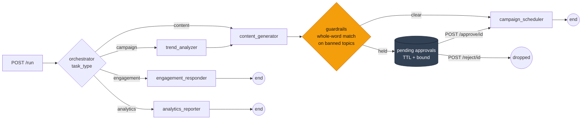
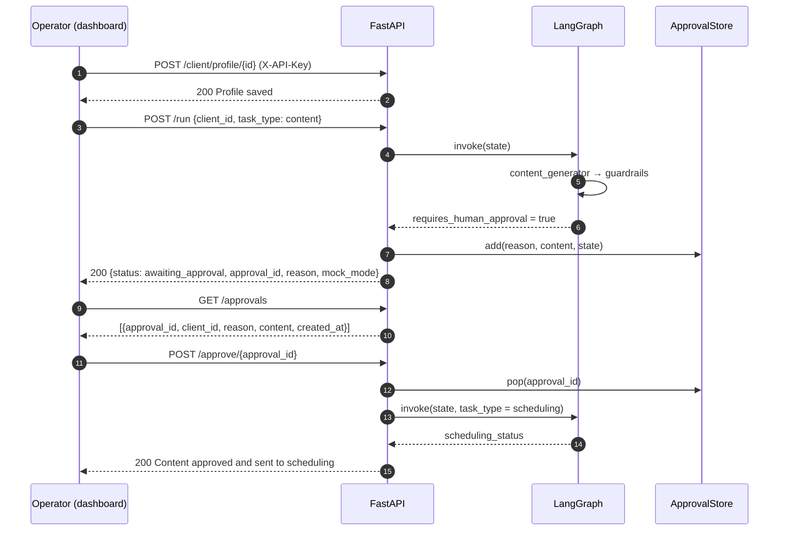
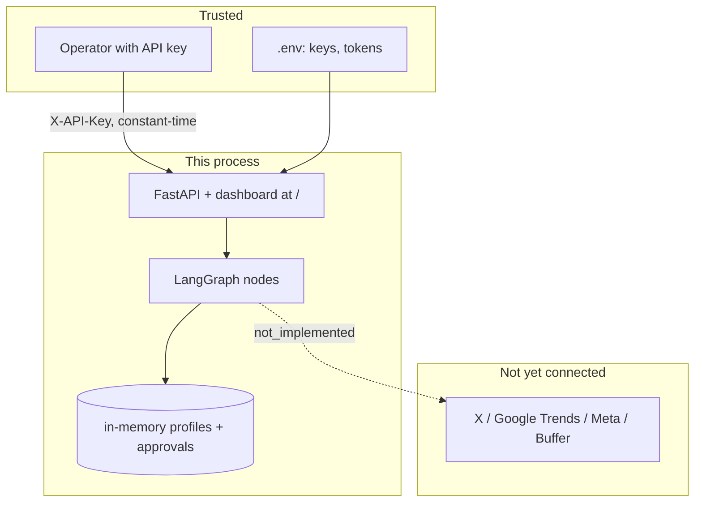

# SocialPilot

[](https://github.com/daniellopez882/Social-Media-Autopilot-Agent-with-MCP/actions/workflows/ci.yml)


A LangGraph workflow that drafts social-media content for a brand, **holds it
for a human when it names a banned topic**, and hands approved content to a
scheduling step. Agents are [crewai](https://github.com/crewAIInc/crewAI); the
API is FastAPI; the dashboard is one page served by the same process.

## At a glance

| | |
|---|---|
| **Does** | Route a task to the right agents, generate content (mock or model), hold it on a whole-word banned-topic match, queue it for approval, list/approve/reject through an authenticated API and a dashboard |
| **Does not** | Talk to any social platform. All four platform tools return `status: "not_implemented"` outside mock mode. Nothing is fetched or posted anywhere |
| **Is not** | An MCP server or client. There is no MCP code in this repository, despite its name |
| **Tests** | 189 — none reach a network or need a credential |
| **CI** | lint · tests on 3.11/3.12 · server booted and its contract exercised · bandit · container built, run, and checked |
| **Container** | non-root (uid 10001), multi-stage, refuses an invalid configuration at startup |
| **Live model path** | tested with fakes and by construction against the real `crewai`; **not** run against the OpenAI API here |

## Architecture



`scheduling` is how an approved item re-enters the graph. It is **not** a
public task type, because it bypasses guardrails.

### A held item, end to end



## Quick start

```bash
python -m venv .venv && . .venv/bin/activate     # Windows: .venv\Scripts\activate
pip install -r requirements.txt
cp .env.example .env
```

To run without a model key, say so explicitly — mock mode is **off** unless
you turn it on:

```bash
MOCK_MODE=true API_KEY=dev uvicorn app.main:app --reload
```

Open <http://127.0.0.1:8000/>, paste the key into the sidebar, register a
profile, run a task. Every response carries `mock_mode`, and every mock value
is prefixed `[MOCK]`.

For live mode set `OPENAI_API_KEY` and leave `MOCK_MODE` unset. Preflight
(`python -m app.preflight`, also run at startup) refuses to serve production
with mock mode on or with no `API_KEY`.

### Container

```bash
docker build -t socialpilot .
docker run --rm -p 8000:8000 --env-file .env socialpilot
```

The container exits non-zero on an invalid configuration rather than serving.

## Configuration

Every setting, with its default, is in [`.env.example`](.env.example).

| Variable | Default | Notes |
|---|---|---|
| `MOCK_MODE` | `false` | Labelled mock data everywhere; refused in production. A blank value is "off" |
| `API_KEY` | *(empty)* | Required by every route that reads or changes state. Empty is allowed in development only |
| `OPENAI_API_KEY` / `OPENAI_MODEL` | — / `gpt-4o` | The only wired provider |
| `TWITTER_API_KEY`, `META_ACCESS_TOKEN`, `BUFFER_ACCESS_TOKEN` | *(empty)* | No live integration uses them yet; tools report `not_implemented` either way |
| `APPROVAL_TTL_SECONDS` / `APPROVAL_MAX_PENDING` | `86400` / `1000` | The in-memory approval queue expires and is bounded |
| `CORS_ALLOW_ORIGINS` | *(empty)* | Same-origin by default; never a wildcard |

## API

Every route except `/health`, `/ready` and `/` requires `X-API-Key`.

| Route | Purpose |
|---|---|
| `POST /client/profile/{client_id}` | Save a brand profile — `client_id` matches `[A-Za-z0-9][A-Za-z0-9_-]{0,63}` |
| `GET /client/profiles` · `GET /client/profile/{client_id}` | List · read |
| `POST /run` | `{"client_id", "task_type": campaign \| content \| engagement \| analytics}` |
| `GET /approvals` | Pending items, oldest first |
| `POST /approve/{id}` | Send held content to scheduling |
| `POST /reject/{id}` | `{"feedback": "..."}` |
| `GET /health` · `GET /ready` | Liveness · readiness with per-check detail |

## Security model



- Every state change needs the key; approval ids are 128-bit and still need the key.
- The dashboard is served by the API — the old separate server exposed the **repository root** over HTTP.
- Errors return a request id, never the exception text.
- No third-party text reaches a prompt today, only because the tools that would fetch it are not implemented. The [threat model](docs/threat-model.md) records what changes when one lands.

## What changed, and why

This began as a prototype whose success signals were unconditional. Every
defect below was reproduced on the original code before it was fixed.

| # | Defect | Effect |
|--:|---|---|
| 1 | `MOCK_MODE` defaulted to `"true"` and was read once at import | A fake system by default; setting the variable later changed nothing |
| 2 | `except ImportError: MOCK_MODE = True` | `crewai` declares `<3.14`; on 3.14 the app silently became a mock system |
| 3 | `buffer_post_scheduler` returned `"LIVE: Scheduled …"` with a token set | No request was made — **worse** with credentials than without |
| 4 | `instagram_analytics_fetcher` returned `reach: 12000` with a token set | A fabricated metric presented as live data |
| 5 | Guardrails used substring containment | Banning `art` held "st**art** … sm**art**"; banning `X` held everything |
| 6 | The content node appended the brand's first banned topic "for testing" | Every brand with a banned list was escalated on every run — the only reason the old test passed |
| 7 | No authentication on any route | Anyone reaching the port could overwrite any profile or approve content by UUID |
| 8 | `run_dashboard.py` served the repository root | `/app/main.py`, `/requirements.txt`, `/.env.example` returned 200 |
| 9 | Hardcoded "Weekly Growth +12.4%", "14.2K Total Accounts Reached" in the page | Fabricated metrics styled as live |
| 10 | Unknown `task_type` routed to `END` | `POST /run` with `"nonsense"` returned 200 and the untouched state |

<details>
<summary>Ten more</summary>

| # | Defect |
|--:|---|
| 11 | `allow_origins=["*"]` with `allow_credentials=True`, only because the page lived on another port |
| 12 | The graph was recompiled on every request |
| 13 | `detail=str(e)` on every 500 |
| 14 | No `GET /approvals`; dict stores with no TTL or bound — a page reload orphaned held items forever |
| 15 | A failed `ChatOpenAI` construction was swallowed into `llm=None`; the model name was hardcoded |
| 16 | A LangChain model object was handed to crewai, which rebuilds its own client from `os.environ` and cannot see a key that lives only in `.env` |
| 17 | LangChain tools assigned to a crewai agent after construction; crewai's converter is broken in 1.15.20 |
| 18 | `CrewOutput` objects stored in `Optional[str]` fields → not JSON-serialisable → 500 in live mode |
| 19 | `requirements.txt` unpinned; `sqlalchemy` and `langchain-anthropic` imported by nothing |
| 20 | `while True: pass` in the dashboard server — one core pinned |

</details>

## Design notes

| Record | Decision |
|---|---|
| [ADR 0001](docs/adr/0001-mock-mode-is-opt-in.md) | Mock mode is opt-in, read at call time, refused in production |
| [ADR 0002](docs/adr/0002-unimplemented-tools-say-so.md) | A tool that is not implemented says so |
| [ADR 0003](docs/adr/0003-guardrails-match-whole-words.md) | Guardrails match whole words; production code carries no test hooks |
| [ADR 0004](docs/adr/0004-one-process-serves-api-and-dashboard.md) | One process serves the API and the dashboard; every state change needs a key |
| [ADR 0005](docs/adr/0005-crewai-integration.md) | crewai gets its own LLM with an explicit key; LangChain tools are adapted |
| [Threat model](docs/threat-model.md) | Assets, boundaries, eight threats, what is not addressed |

## Layout

```
app/
  main.py            routes, auth, lifespan (preflight + graph compile)
  config.py          settings; MOCK_MODE default False
  preflight.py       python -m app.preflight
  guardrails.py      whole-word banned-topic matching
  approvals.py       in-memory pending approvals, TTL + bound
  graphs/            nodes.py, orchestrator.py
  agents/factory.py  crewai agents; LLM with an explicit key
  tools/             the four platform tools (not implemented) + crewai adapters
social_media_prompts.py   the agent prompts
index.html           the dashboard, served at /
tests/               189 tests
docs/                ADRs, threat model
```

## Limits

- State is process memory. A restart loses profiles and pending approvals; replicas would not share them.
- One shared API key. The dashboard keeps it in `sessionStorage` for the tab.
- No platform integration exists — see [ADR 0002](docs/adr/0002-unimplemented-tools-say-so.md).
- No latency or cost figures: nothing here has been measured against a model.

## Licence

MIT — see [LICENSE](LICENSE).
